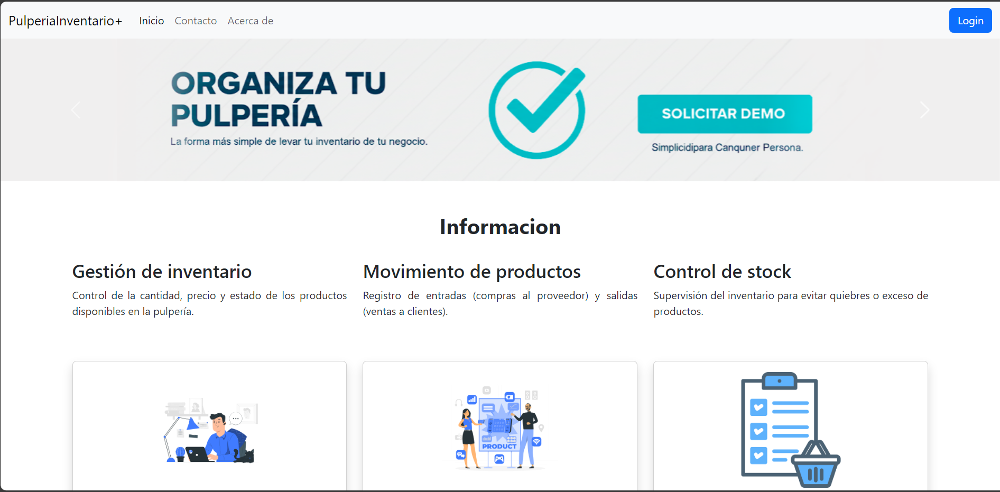
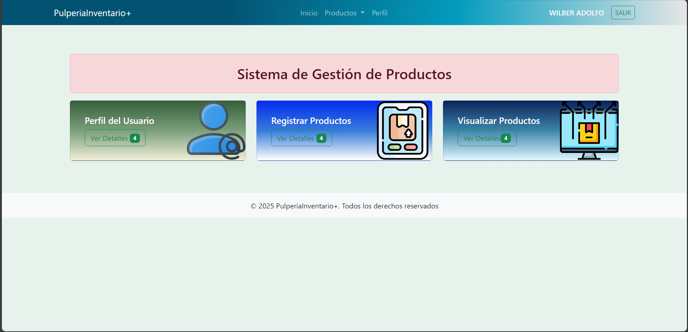

## Instalacion de archivos requeridos

** crear el entorno virtual**
python -m venv venv

**Crear el archivo**
pip freeze > requirements.txt

**Instalarlo**
pip install -r requirements.txt

**Recursos:
Python 3.13.5

Microframework web:
Flask
Gestor de base de datos:
MySql

## Vistas principal

## Vista de accesos

## Vista dashboard(panel)
